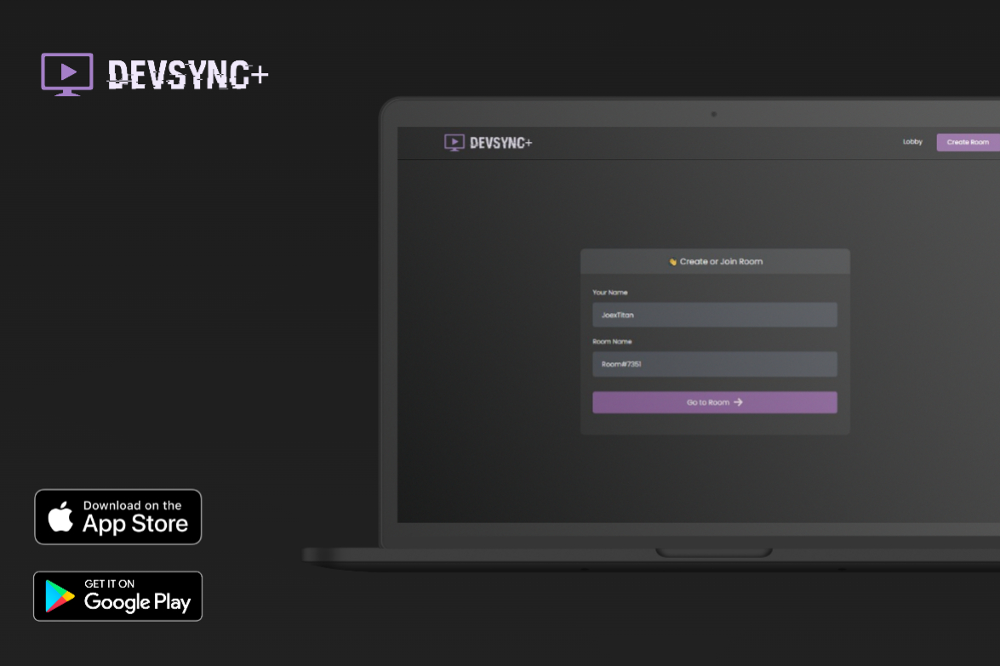
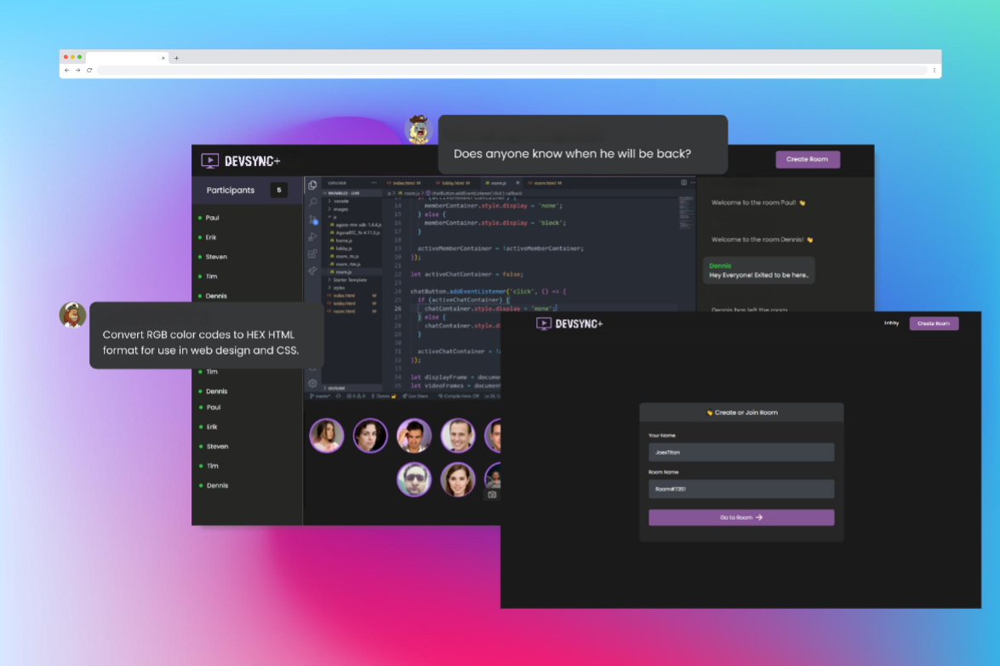

# DevSync+

A Streaming Service Built With Developers in Mind! App is Live @ https://dev-sync-plus.vercel.app

DevSync+ is powered by WebRTC and uses Agora.io framework to delivery latency free streamlined videos.

Amplify your coding genius by effortlessly sharing your screen with fellow developers. Show, teach, and collaborate like never before!

<!-- <video controls muted> <source src="./img/firstDemo.mp4" type="video/mp4">Your browser does not support the video tag.</video> -->

🎥 Picture in Picture: Enhance your streaming experience with the magic of Picture in Picture. Multitask seamlessly while watching live coding sessions or engaging in collaborative discussions.

🔤 Live Captions: Break language barriers and ensure inclusive communication with real-time live captions. Every line of code becomes crystal clear for all participants.

💬 Text Chat: Connect, discuss, and exchange ideas with a vibrant community of developers through our interactive text chat. Share code snippets, ask questions, and build lasting connections.

<!-- <video controls muted> <source src="./img/secondDemo.mp4" type="video/mp4">Your browser does not support the video tag.</video> -->

📺 Auto-Scaling Video Quality: Enjoy flawless streaming with our intelligent auto-scaling video quality. The platform adapts to your network conditions, delivering the highest visual fidelity at all times.

🌐 No Download Required: Dive into the coding universe instantly, right from your browser. No downloads, installations, or complex setups needed. Seamless access, hassle-free.

⚡️ Lowest Latency: Experience unparalleled real-time interaction with direct peer-to-peer connections. Our platform ensures the lowest latency possible, enabling instant collaboration and lightning-fast feedback.

🔒 Single Use Disposable Chat Rooms: Create secure and private chat rooms for focused collaborations. Each room is exclusively dedicated to your project, providing a safe space to brainstorm and innovate.

